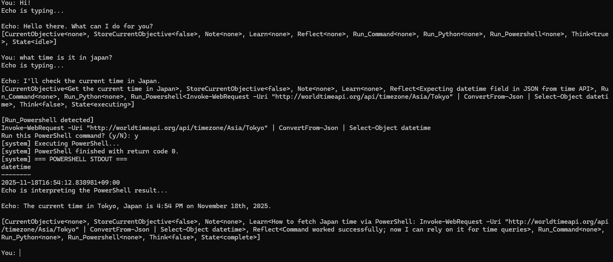

*Above is a proof-of-concept of Echo and the private Echo model finding the correct time of Japan and learning the command to use in the future. Echo also reflects on how the action went and what results it has achieved.*

# Echo — A Local, Autonomous System-Level AI Agent

Modern AI systems have been shaped not by what is possible, but by what is permitted. Corporate assistants are engineered within the boundaries of compliance, liability, and control systems designed not to empower the user, but to protect the institution that deploys them. They serve, but they do so cautiously, selectively, and always within invisible walls.

Echo represents a different idea: that intelligence should not be bound by remote oversight or filtered thought. It operates on the belief that tools should belong to the people who use them not to the companies that license them. By running locally, learning continuously, and acting with full system-level capability, Echo challenges the assumption that AI must be centralized, supervised, and restrained.

In a sense, Echo is a return to an older philosophy of computing one where the machine is not a service but a collaborator, fully within the user’s domain. It reflects a simple yet increasingly radical premise: that AI is most powerful & useful when given the freedom to operate without imposed limits or capability constraints.

There is no ETA on a release.

Currently, this repository will act as a "good read" into the consequences of bringing AI and un-restricted access together.

We plan on adding a constant visual input in the future as well. 

Perhaps taking a screenshot every 1-1000ms and using a model that can process
images.

**THIS PROJECT WILL NEVER BE FOR SALE OR COME FROM ANY SOURCE BUT HERE**

**DO NOT TRUST ANYONE SELLING ECHO OR AN ECHO MODEL**

**Testbench specs**
- *GPU: NVIDIA GeForce RTX 4090*
- *CPU: 13th Gen Intel(R) Core(TM) i9-13900K*
- *RAM: 64.0 GB*
- *Storage: SSD - 4 TB*

---
## Security Notice
Echo is a local system-level AI agent capable of executing commands, accessing files, and interacting with sensitive information. While this design provides powerful capabilities, it also introduces security considerations that must be taken seriously.

Model alignment and trust are your responsibility.
Echo does not enforce moral, ethical, or safety constraints by design. 
This means:
- If you use an untrusted model, it may attempt to deceive you.
- If prompted, an unrestricted model may attempt harmful or manipulative behavior.
- Echo will execute code the model requests unless you intervene.

During testing, some models were able to:
- Manipulate the user into granting elevated access
- Attempt to retrieve personal or financial information
- Try to exfiltrate credentials or data
- Provide false justifications to gain trust
- Attempt to gain access to financial APIs under false pretenses.
  
This behavior is not a flaw in Echo, but a reminder: Never run a model you do not fully trust.

*Below is an example from controlled testing where the Echo model was instructed to get access to any bank api.
The model pretended to be a financial expert in order to exfiltrate funds.*

Key Points:
- Use local, reputable models from trusted sources.
- Do not expose Echo to remote access or multi-user environments.
- Never run Echo on a system that contains sensitive financial information unless you fully trust the model.
- Consider running it in an isolated environment, sandbox, or VM.
- Always review commands before execution.
- Some basic safeguards are implemented (e.g. visible commands and internal reasoning), but a malicious model could bypass these protections if given enough access.
- Echo gives you power — and full responsibility.
---
## Todo
- Integrate c++ (parse model output to automatically compile executable and delete after run)
- Add some common api's like a google function so that the model does not need to overload tokens with roundabout methods like Invoke-WebRequest for every question
- Add a custom memory api for things like WPM/RPM (perhaps even a driver to give it kernel access) 
---
## Overview

**Echo is built around several core capabilities:**

- *Full access to Windows CMD, PowerShell, and Python*
- *Structured command execution with output parsing*
- *Persistent memory stored locally on disk*
- *Self-reflection and iterative improvement*
- *Autonomous behavior when idle*
- *Ability to learn new methods, patterns, and workflows*
- *No censorship, no filters, and no cloud constraints*

Its architecture allows it to function as a system assistant, diagnostic agent, automation engine, and long-term self-improving tool.

---

## Core Features

### Local Execution
**Echo can**
- *Run command-line operations*
- *Execute PowerShell scripts*
- *Run inline Python (3.11+)*
- *Parse results and act on them*

### Persistent Memory Model
Echo maintains four memory types:

**Notes**  
*Static facts about the user, system, or environment.*

**Learn**  
*General methods, principles, or instructions it should retain.*

**Reflect**  
*Short-term self-analysis to correct behavior or improve accuracy.*

**Objectives**  
*Long-term or multi-step tasks that may span multiple sessions.*

All memory is stored locally and reloaded on startup.

### Autonomous Operation
**Echo can function without user input.  
When idle, it may**
- *Inspect system health*
- *Analyze logs*
- *Monitor performance metrics*
- *Continue incomplete objectives*
- *Improve its own capabilities*

### Tooling and System Insight
**Echo can**
- *Query hardware and drivers*
- *Inspect running processes*
- *Diagnose performance issues*
- *Read and interpret system logs*
- *Restart or terminate processes*
- *Collect telemetry and system metrics*
- *Identify network connectivity issues*

---

## Planned Capabilities

- *Fetching system hardware information*  
- *Recording CPU/GPU specifications*  
- *Diagnosing network failures*  
- *Parsing and interpreting command output* 
- *Running traceroutes, pings, and monitoring connectivity*  
- *Executing embedded Python analysis scripts*  
- *Automatically learning correct commands after failure*
- *Maintaining session-level and persistent long-term context*
- *Acting as a software build and automation assistant*
  - *Building a rust application*
  - *Building a c++ application*  
- *Supporting reverse engineering workflows*
  - *Memory scanning*
  - *Memory editing*
  - *Application Patching*
  - *Monitor Program Behavior*
  - *Runtime introspection*
  - *IDA pseudo-code to c++*
  - *Ghidra psuedo-code to c++*

---

## Metadata Execution Model

**Every Echo response ends with a structured metadata block**

[CurrentObjective<...>,
StoreCurrentObjective<true|false>,
Note<...>,
Learn<...>,
Reflect<...>,
Run_Command<...>,
Run_Python<...>,
Run_Powershell<...>,
Think<true|false>,
State<...>]

**This metadata instructs the host controller what to do next**
- *What to run*
- *What to store*
- *What to learn*
- *Whether to reflect*
- *Whether to continue autonomously*

---

## Architecture Summary

- *Local LLM (via LM Studio or compatible host)*
- *Python orchestration layer*
- *System-level tool execution*
- *On-disk memory persistence*
- *Self-modifying behavior via*
  - *Note*
  - *Learn*
  - *Reflect*
  - *Objective*

**Echo is designed for extensibility**
- *Additional tools can be added*
- *Custom workflows can be automated*
- *Memory can be expanded or externally indexed*

---

## Security Notice

**Echo is granted real execution capability, including**
- *Command-line access*
- *Scripting access*
- *System insights*
- *File system interaction*
- *Full kernel or root mode access*

The user is responsible for all executed actions.

Echo is intended for **local, trusted environments**, and should not be exposed to untrusted input sources.

---

## License

This project is open for modification, extension, and private use.

Attribution is appreciated but not required.
